# super_imx519 設計書

> ステータス: 設計段階。エッジの CLI 撮影（[imx519_edge](https://github.com/HayatoShimada/imx519_edge)）と、サーバー側の合成の試作（`src/super_imx519/pipeline/stacking.py`）がある。
> 表記: **決定** = 合意済み / **案** = 提案段階 / **推定** = 計算や推論による値 / **要確認** = 未検証
> 機材の仕様と出典は [docs/](docs/README.md)、方向性を決めた経緯は [docs/background/discussion-2026-10.md](docs/background/discussion-2026-10.md) にある。

## 目的とゴール

- **被写体**: 壁にハンガーで掛けた洋服（決定）
- **ゴール**: 実物どおりの質感で撮り、Web 掲載では Canon EOS R6 で撮ったものと見分けがつかない水準を目指す（決定）
- **質感の原則**: 実物にある情報だけで画質を上げる。**AI 生成系の超解像（Real-ESRGAN など）は使わない**。実物とのギャップがクレームにつながるため（決定）
- **出力先**: 自社 EC（85-store、Shopify）の商品画像（決定）

## 基本方針

- お金をかける順番は **照明 → 撮影の手間（枚数）→ カメラ本体**（決定）
- 被写体が動かないことを最大の武器にする。固定したカメラで多数のフレームを撮り、合成で小さいセンサーの弱点（ノイズ、ダイナミックレンジ、解像）を補う
- 撮影条件（照明、露出、ピント、カメラ位置）を固定して記録し、再現できるようにする

## システム構成

```mermaid
flowchart LR
  subgraph Stage[撮影ステージ]
    Light[NEEWER NL-192AI ×2<br/>+ 拡散材]
    BG[背景 白/グレー]
    Subject[洋服 ハンガー掛け]
    Card[24色カラーカード]
  end
  subgraph Edge[Raspberry Pi 5 85pi]
    Cam[Arducam IMX519]
    PT[Pan-Tilt B0283<br/>PCA9685 0x40]
    App[imx519_edge<br/>カメラデーモン + 撮影アプリ]
    CMS[85store-cms<br/>docker compose]
  end
  subgraph Server[home-linux]
    Studio[super_imx519<br/>取り込み・処理・登録]
    ROCm[rocm_opencv_server<br/>写真の区分の判定]
  end
  Phone[スマホのブラウザ]
  Shopify[(Shopify)]

  Cam -- "CSI-2（制御は RP1 の I2C）" --> App
  PT -- "i2c-1 (GPIO2/3)" --> App
  Phone -- "tailnet :12443" --> App
  App -- "下書きを作る（REST）" --> CMS
  Studio -- "セッションを取り込む" --> App
  Studio -- "区分の判定" --> ROCm
  Studio -- "写真を足す（REST）" --> CMS
  CMS -- "保留を外して保存" --> Shopify
  Light -.照明.-> Subject
  Cam -.撮影.-> Subject
  Cam -.撮影.-> Card
```



| ノード | 役割 |
| --- | --- |
| 85pi（Raspberry Pi 5） | [imx519_edge](https://github.com/HayatoShimada/imx519_edge): 撮影（露出・ピントの制御、DNG 保存）、パンチルトの制御、スマホ向けの撮影アプリ、CMS への下書きの作成。同じ 85pi で 85store-cms も動いている |
| home-linux（Tailscale `100.108.168.101`） | super_imx519（このリポジトリ）: セッションの取り込み、現像・HDR 合成・超解像・色補正などの重い処理、CMS への写真の登録。Radeon RX 7900 XTX を積む。同じホストの [`rocm_opencv_server`](../rocm_opencv_server/) は写真の区分の判定に使う |
| 85store-cms（`https://cms.85-store.com`） | 商品の入力画面（Payload）。商品の正は Shopify。仕様は [85store-cms.md](docs/software/85store-cms.md) |

カメラの I2C（Pi 5 は RP1 の `i2c@80000`）とパンチルトの I2C（i2c-1）は別のコントローラなので、衝突しない（[raspberry-pi-4.md](docs/hardware/raspberry-pi-4.md)）。

## ハードウェア

| カテゴリ | 製品 | 数量 | 状態 | 詳細資料 |
| --- | --- | --- | --- | --- |
| カメラ | Arducam IMX519（16MP / AF） | 1 | 手元 | [imx519.md](docs/hardware/imx519.md) |
| エッジ | Raspberry Pi 5（8GB、`85pi`）。IMX519 の認識・AF・DNG 保存を確認済み（2026-10-08） | 1 | 稼働中 | [imx519.md](docs/hardware/imx519.md#実機で確認した結果2026-10-08raspberry-pi-5-85pi) |
| エッジ（予備） | Raspberry Pi 4 Model B（`85pi4`） / Zero W（試行して打ち切り） | — | 手元 | [raspberry-pi-4.md](docs/hardware/raspberry-pi-4.md) |
| パンチルト | Arducam Upgraded Pan-Tilt Platform（B0283） | 1 | 手元・微動に使えるか検証待ち | [pan-tilt-b0283.md](docs/hardware/pan-tilt-b0283.md) |
| 照明 | NEEWER NL-192AI | 2 | 手元 | [neewer-nl-192ai.md](docs/hardware/neewer-nl-192ai.md) |
| カラーカード | Sxhlseller 24 色（ColorChecker Classic 互換品） | 1 | 手元 | [color-card.md](docs/hardware/color-card.md) |
| 位置合わせマーカー | ArUco マーカーをマット紙に印刷（一辺 5 cm 程度）。壁の 4 隅に貼る | 4 | 未作成（案） | [日ごとの配置ズレ補正](#日ごとの配置ズレ補正4-隅マーカー) |
| 画像処理サーバー | home-linux（Tailscale 経由） | 1 | 稼働中 | — |
| ライトスタンド | NL-192AI 用 | 2 | 要確認（2 台キットなら付属） | [neewer-nl-192ai.md](docs/hardware/neewer-nl-192ai.md) |
| 拡散材 | ディフューザー / トレーシングペーパー / アンブレラ など | 2 | 未購入（案） | — |
| 背景 | 白かグレーの無地の布または背景紙 | 1 | 未購入（案） | — |
| サーボ用電源 | 外部 5V（GND 共通） | 1 | 必要なら（案） | [raspberry-pi-4.md](docs/hardware/raspberry-pi-4.md) |
| 微動ステージ | NEMA17 + TMC2209 のリニアステージ など | 1 | パンチルトが不合格のときの代替（案） | [discussion-2026-10.md](docs/background/discussion-2026-10.md#会話に出た購入候補) |
| カラーチャート（正規品） | Calibrite ColorChecker Classic | 1 | 互換品の色ずれを実測したいとき、または絶対的な色精度が必要なとき（案） | [color-card.md](docs/hardware/color-card.md) |

## ソフトウェア構成

### リポジトリ（決定。2026-10-09）

動くマシンごとに分ける。

```text
~/orca/
├── super_imx519/        設計 + サーバー側（home-linux）。処理は src/super_imx519/pipeline/
├── imx519_edge/         エッジ（85pi）。85pi では ~/imx519_edge に clone し、git pull で更新する
├── 85store-cms/         商品の入力画面（別リポジトリ。連携のための変更は PR で出す）
└── rocm_opencv_server/  写真の区分の判定（Clef）を借りる。処理は載せない
撮影データ: home-linux の ~/data/super_imx519/sessions/<session_id>/（リポジトリの外）
処理の結果: home-linux の ~/data/super_imx519/results/
```

- 処理を rocm_opencv_server に載せない理由: rocm_opencv_server は画像を 1 枚受け取ってすぐ返す、状態を持たない API。こちらは GB 単位のセッションを数分かけて処理するジョブで、性質が違う。GPU まわり（Docker、OpenCL の設定）だけを参考にする
- 85pi の空きは約 20 GB（使用率 82%、2026-10-09）。1 カットは約 1 GB なので、撮影データは 85pi に貯めない（[転送](#転送決定サーバーが取りに行く)）

### エッジ（Raspberry Pi 5 `85pi`）

- 当初は Pi 4 を想定していた。Zero W を試したが、メモリ不足などで固まったため打ち切り、Pi 5 に変更した（2026-10-08。経緯は [imx519.md](docs/hardware/imx519.md#raspberry-pi-zero-w-での試行2026-10-08打ち切り)）
- `85pi` はほかの用途（Cockpit など）と兼用のマシン。ログインは `hacopi@85pi`（Tailscale: `85pi.taila713c8.ts.net`）
- 85pi のフォルダ（2026-10-09 に整理）
  - `~/imx519_edge/`: コード（git。`git pull` で更新する）
  - `~/captures/<session_id>/`: 撮影データの一時置き場。サーバーが取り込んだら消す
  - `~/archive/arducam-install-2026-10-08/`: Arducam 版 libcamera を入れたときのインストーラ・deb・`setup.log`（入れ直すときの記録）
- Raspberry Pi OS（Trixie、64bit）
- `/boot/firmware/config.txt` に `camera_auto_detect=0`、`dtoverlay=imx519`、`dtparam=i2c_arm=on` を書く
- **Arducam 版 libcamera**: IMX519 の AF と手動レンズ位置にはこれが必須（決定事項ではなく、調べて分かった制約）。`apt upgrade` で Raspberry Pi 版に戻らないよう、パッケージを固定する
- Picamera2（apt）で撮影を制御する。PCA9685 は venv（`--system-site-packages`）で smbus2 か Adafruit ServoKit を使う
- 制御の詳細は [camera-control.md](docs/software/camera-control.md) を参照

### サーバー（home-linux）

- Python + OpenCV。このリポジトリ（super_imx519）に、取り込み・処理・CMS への登録をまとめる（決定）
- RAW の現像は rawpy（LibRaw）を使う。位置合わせ（ECC）・平均・Mertens の試作は `src/super_imx519/pipeline/stacking.py`、セッションをまとめて試すのは `scripts/stack_session.py`

## 撮影アプリと 85store-cms の連携（2026-10-09）

スマホのブラウザから撮影を操作し、撮った写真を 85store-cms の商品の下書きにつなげる（決定）。主な利用者は管理者 1 人で、スタッフの利用は考えない。CMS の仕様は [85store-cms.md](docs/software/85store-cms.md) にある。

### 全体の流れ

```text
[スマホ] ─ https://85pi.taila713c8.ts.net:12443 ─▶ [85pi: imx519_edge]
  1. 商品を入力（既存の値から選ぶ）──▶ CMS の REST: brands / products を読む（10 分キャッシュ）
                              └─▶ POST /api/products（保留の下書き）→ CMS の商品 ID
  2. 撮影（正面・背面…を同じ商品で続けて撮る）→ session.json に CMS の商品 ID を記録
[home-linux: super_imx519]
  3. 取り込み: エッジから取り込み、sha256 で照合してから、エッジ側を消す
  4. 処理: 現像 → HDR → 位置合わせ・平均（→ 超解像）→ 色 → 幾何 → sRGB の JPEG（長辺 2048 以内）
  5. 登録: rocm_opencv_server の POST /v1/photo-label で写真の区分を判定
          → CMS に POST /api/productPhotos → PATCH /api/products/:id で images に足す（autoAltLabel 付き）
[CMS]
  6. 価格・SKU・原価・採寸などを入れ、保留を外して保存 → Shopify に商品が作られる
```

- **商品のキーは CMS の商品 ID（数値）**（決定）。handle は新しい商品のときと公開に変えたときに作り直されるので、キーにしない。Shopify の商品 ID は、保留を外すまで無い
- **CMS の呼び方**: 85pi と home-linux は、どちらもタグなしの管理者の端末。CMS の whois の認証をそのまま通るので、CMS に API キーを足さずに Payload の REST を呼べる（2026-10-09 に両方から実測）
- **写真の区分は撮影時に入れない**: 登録時に、rocm_opencv_server の Clef で判定する（決定）。区分の語は CMS の `AUTO_ALT_LABELS` と同じ 16 語

### 撮影アプリの画面（imx519_edge）

デーモンが画面も出す。ビルドなしの HTML と JS で、スマホを主に作る。PC からは、調整用の詳しい設定（露出・ピント・パンチルト・プリセット）も触れるようにする（案）。

- **画面 1「商品」**: 新しい商品を作るか、保留中の下書き（`shopifyHold: true`）を選んで続きを撮る
  - 区分（古着 / 新品 / 委託）
  - ブランド（既存から検索。無ければその場で `POST /api/brands`）
  - 品名（自由入力）
  - Shopify のカテゴリ（既存の categoryId / categoryName の組から選ぶ。同名で ID が違うものは ID の末尾を添える）
  - 品目（既存の productType から選ぶ。カテゴリを選ぶと、そのカテゴリで一番多い品目を初期値にする）
  - 「下書きを作って撮影へ」で、CMS に `POST /api/products` を送る
    - 入力した値: `kind`、`brand`、`name`、`productType`、`categoryId`、`categoryName`
    - 固定の値: `autoTitle: true`、仮の `title`（保存時に CMS が作り直す）、`status: draft`、`variants: [{ price: 0 }]`、`shopifyHold: true`
- **画面 2「撮影」**: 商品名、ライブビュー、撮影ボタン（設定ファイルにある既定の手順。EV・枚数・微動）、進捗、この商品で撮ったセッションの一覧。裏返して背面を撮る、といった撮り足しを続けられる

### エッジのデーモン（imx519_edge）

- **プロセス**: uvicorn のワーカーを 1 つだけ立て、Picamera2 と PCA9685 を独占する。カメラを開けるのは 1 プロセスだけなので、CLI（`python3 -m imx519_edge burst`）とデーモンは同じ関数を使い、同時には動かさない
- **状態**: `idle`（ライブビュー中）/ `moving` / `capturing` / `error`。ジョブは 1 本ずつ実行する（排他ロック）
- **カメラの設定**: フル解像度の still 設定に lores ストリームを付け、常にそのモードで動かす（9 fps）。ライブビューは lores をソフトウェアで MJPEG にする（Pi 5 には JPEG や H.264 のハードウェアのエンコーダが無い）。撮影中はライブビューを止める
- **公開**: `127.0.0.1:8519` で待ち受け、`tailscale serve --https=12443`（tailnet only）で出す。85pi のほかのサービスと同じやり方。ACL は変えない。`Tailscale-User-Login` ヘッダから操作者を取り、セッションに記録する
- **環境**: `python3 -m venv --system-site-packages`（picamera2 と libcamera は apt のもの）に fastapi と uvicorn を入れ、systemd のユーザーサービスにする
- **パンチルトの安全策**: 可動範囲を設定ファイルで持つ。移動のたびに full-off し、非常停止（ALL_LED_OFF）を用意する
- **ディスクの保護**: 撮影を始める前に容量を見積もる（枚数 × 約 36 MB）。「空き − 見積もり」が予備の 5 GB を下回るなら断る（85pi はほかの用途と兼用のため）

API（v1 の案）:

| メソッド | パス | 内容 |
| --- | --- | --- |
| GET | `/api/status` | 状態、カメラの固定値、パンチルトの位置、空き容量、実行中のジョブ |
| GET | `/api/preview.mjpg` / `/api/preview.jpg` | ライブビュー（MJPEG / 1 枚） |
| POST | `/api/camera/meter` | AE / AWB / AF を一度走らせ、測った値を固定値として持つ |
| PUT | `/api/camera/settings` | 固定値（基準の露光時間・`ColourGains`・`LensPosition`）を手で変える |
| POST | `/api/camera/auto` | 固定をやめて自動に戻す |
| POST | `/api/pantilt/move` | 移動（tick 単位、近づける方向も指定できる）。移動後は自動で full-off |
| POST | `/api/pantilt/stop` | 非常停止 |
| GET / PUT | `/api/pantilt/presets` | 構図のプリセット |
| GET | `/api/cms/options` | 区分・ブランド・カテゴリ・品目の選択肢（CMS から作ってキャッシュ） |
| GET | `/api/cms/products` | 保留中の下書き |
| GET | `/api/cms/products/{id}` | 商品 1 件（撮影ジョブはこれを写して session.json に入れる） |
| POST | `/api/cms/products` | 下書きを作る（`brand_name` を渡すと、無いブランドを先に作る） |
| POST | `/api/jobs` | 撮影ジョブ（`cms_product_id` は必須。EV、枚数、微動の位置数と量、照明、メモ） |
| GET / DELETE | `/api/jobs/{id}` | 進捗 / 中止 |
| GET | `/api/events` | 状態と進捗を Server-Sent Events で流す（EventSource が切れても自動でつなぎ直すので、WebSocket ではなくこちらにした） |
| GET | `/api/sessions` | 85pi に残っているセッション |
| GET | `/api/sessions/{id}/manifest` | ファイル名・サイズ・sha256 |
| GET | `/api/sessions/{id}/files/{name}` | ファイルのダウンロード |
| DELETE | `/api/sessions/{id}?manifest_sha256=…` | 消す。取り込み側が全ファイルの sha256 を確かめてから、manifest の sha256 を添えて呼ぶ（一致しなければ 409） |

### セッションの形式（schema_version 1。エッジが決める）

- `session_id` は `YYYY-MM-DD_HHMMSS_c{CMS の商品 ID}`。ファイル名は `p{位置:02d}_ev{EV:+.1f}_{連番:02d}.{dng,jpg,json}`
- `session.json` の項目
  - `schema_version`、`session_id`、`created_at`、`operator`
  - `product`: `{cms_id, title, kind, product_type, category_id}`。撮影時点の写しで、handle は持たない
  - `lighting`（灯ごとの色温度・明るさ・距離）、`note`
  - `camera`（`lens_position`、`colour_gains`、`base_exposure_us`、`rotate180`）
  - `sequence`（`ev`、`frames`、`positions`、`jitter_ticks`）
  - `shots[]`（`stem`、`ev`、`position`、`pan`、`tilt`、`approach`、`meta`）
  - `software`（imx519_edge の git の版）
- 形の定義は imx519_edge の `imx519_edge/session.py`。それ以前の形（schema_version が無く、ファイル名は `ev{EV}_{NN}`）は v0 として、サーバー側でも読む

### 転送（決定。サーバーが取りに行く）

- super_imx519 の取り込みが、エッジの API でセッションの一覧と manifest を取り、ファイルを落として sha256 で照合し、`~/data/super_imx519/sessions/` に置いてから、エッジの `DELETE` を呼ぶ
- 85pi にサーバーの認証情報を置かずに済む。最初は手で実行し（`uv run python -m super_imx519.ingest`）、後で systemd timer にする
- 撮影中のセッションは `~/captures/.partial-<id>` に書き、終わって manifest を書いてから `<id>` に移す。一覧と取り込みの対象は、manifest のあるものだけ

### 85store-cms への変更（決定。85store-cms のリポジトリで PR を出す）

1. **保留の欄**: `products` のサイドバーに `shopifyHold`（「Shopify にまだ送らない（撮影・入力中）」）を足す
   - SKU・原価・初期在庫は Shopify に作るときにしか送られない。そのため、撮影時に作る下書きは、情報が揃うまで Shopify に作らずに止めておく
   - 保留中は `productBeforeChange` で同期の状態を pending にせず、`productAfterChange` で同期のキューにも入れない
   - 保留を外して保存するとき、価格が 0 なら止めて「価格を入れてください」と出す。外すと通常どおり作られる
   - マイグレーションを足す。一覧に保留の列を出し、絞り込めるようにする
2. **新しい写真の区分**: `src/shopify/sync.ts:255` で `autoAltLabel` を渡す（`autoAlt(desired.title, i, images[i]?.autoAltLabel)`）。今は新しい写真の区分が無視され、「n枚目」になる
3. デプロイは PC の `./deploy.sh` で行う（85pi ではビルドしない）

### rocm_opencv_server への変更（案）

- `POST /v1/photo-label`（`X-Internal-Token` 付き）を足す。画像 1 枚を受け取り、`clef.from_settings` と `app/shopify.py` の `photo_label` で `{label, view, part, confidence}` を返す。区分を判定するところは、今あるものをそのまま使う

### 実装の段階

- **Phase 0（2026-10-09 に完了）**: 設計、リポジトリの再編、エッジの CLI を整理して session.json を v1 にする、合成の試作を super_imx519 へ移す
- **Phase 1（2026-10-09 に実装）**: エッジのデーモンと撮影アプリ、CMS の変更（保留、写真の区分）、super_imx519 の取り込み
  - 85pi で常駐させた（systemd のユーザーサービス `imx519-edge`、`https://85pi.taila713c8.ts.net:12443`）。撮影 → 取り込み（sha256 で照合）→ 85pi 側の削除まで、実機で通した
  - CMS の変更は 85store-cms の PR #23 で本番にデプロイした（2026-10-09。同時に #22 の AI 用の MCP サーバーも出た）。撮影アプリは、CMS に保留の欄が無いと分かると下書きを作らない
  - 撮影アプリには、ライブビューの接続ボタン、通信状態（通知・API の応答時間・ライブビューの fps・CMS に届くか）、小さなログ欄がある。tailnet 経由のライブビューは約 8.7 fps・1.9 Mbps（2026-10-09）
  - パンチルトはコードだけで、実機では未確認。85pi の I2C の有効化（sudo）と配線の確認のあと、設定の `pantilt.enabled` を true にする
  - ライブビューは上下が逆さまに写っている（今の取り付けの向き）。パンチルトに載せたあとで、設定の `camera.rotate180` を決める
- **Phase 2**: super_imx519 の処理ジョブと CMS への登録、rocm_opencv_server の `/v1/photo-label`、取り込みと登録の自動化（systemd timer）
- **Phase 3**: パンチルト微動による超解像、ArUco によるずれ表示、ピント合わせの補助

## 撮影設計

### 画角と距離

- IMX519 の画角は 66°(H) × 49.5°(V)。距離 1 m で約 1.30 m × 0.92 m が写る（推定）
- 服の全身を撮るには 1.0〜1.2 m 離す。縦長の被写体なので、縦構図にするかを検討する（案）
- 広角レンズなので周辺が歪む。チェッカーボードで `cv2.calibrateCamera` を実行し、`undistort` で補正する前提とする（案）

### 露出

- **RAW (DNG) で撮る**。現像はサーバー側で行い、ISP の JPEG には頼らない（決定）
- **自動制御をすべて止める**: AE は露光時間とゲインの指定で、AWB は `ColourGains` で、AF は `LensPosition` で固定する（決定）
- ゲインは 1.0。照度は 2 灯で合計約 1300 lux（1 m、拡散前。各 660 lux）なので、長秒露光が要るほど暗くはない見込み。ノイズは多枚数の平均で下げる（推定）
- 長めの露光を使うときは `FrameDurationLimits` を露光時間に合わせて広げる

### HDR

- Pi 4 ではセンサー HDR が使えない。そのため **露出ブラケット（3〜5 段）を撮り、ソフトで合成する**（決定）
- 合成は Mertens の露出融合（`cv2.createMergeMertens`、enfuse 相当）から始める（案）

### ピント

- 被写界深度は、1 m に合わせた場合 約 0.81〜1.30 m（推定。f = 4.28 mm、f/1.75、許容錯乱円 2 px = 2.44 µm で計算）
- ハンガー掛けの服（奥行き 10〜20 cm）なら、**全身ショットは 1 枚で深度が足りる見込み**。フォーカススタッキングは、生地や縫い目などディテールの接写に使う（案）
- LensPosition の値は実際の距離と直線で対応している保証が無い。スタッキングの前に、値と合焦距離の対応と再現性を実測で較正する

### 照明と色

- 2 灯を被写体の左右斜め前、約 45°・やや上に置く。片方を主光、もう片方を弱めの補助光にする（案）
- NL-192AI は光る面が小さい（26.8 × 18.8 cm）。拡散材かバウンスで面を大きくし、影をやわらかくする（案）
- 2 灯の色温度は同じ表示値に揃える。ただし表示値と実際の色温度はずれることがあるので、カラーカードで 2 灯の色が揃っているか確かめる
- NL-192AI にはアプリやリモコンが無い。照明の設定値（色温度・明るさ・距離）は撮影メタデータとして手で記録する
- カラーカードは **ColorChecker Classic の互換品**（並び順は同じ前提）。互換品の色が本物と一致する保証は無いので、使い方を 3 段階に分ける
  1. **一貫性**: 毎回写し込み、ショット間・日ごとの写り方を揃える（確実に使える）
  2. **WB と露出**: 4 行目のグレーで合わせる
  3. **CCM**: Classic の公開基準値（BabelColor / OpenCV `ccm`）を目標に色補正行列を作る。近似として使い、残差 ΔE が大きいパッチは外す（案）
- 絶対的な色の正しさが必要になったら、正規品と並べて撮り、互換品のずれを実測して互換品用の基準値を作る（未決）

## 日ごとの配置ズレ補正（4 隅マーカー）

壁（背景）の 4 隅にマーカーを貼り、日によって三脚の置き方がずれても、同じ構図・同じ縮尺の画像を出せるようにする（決定。2026-10-07 ユーザー案）。

### マーカー

- **種類**: ArUco（`cv2.aruco`、例: `DICT_4X4_50` の ID 0〜3）。ID で四隅を区別でき、角の位置をサブピクセル精度で検出できる（案）
- **大きさ**: 1 m の距離では 1 mm ≈ 3.5 px（推定）。一辺 5 cm なら約 175 px で、十分に検出できる（案）
- **素材と設置**
  - 照明の映り込みを避けるため、マットな紙に印刷する
  - 壁面（背景と同じ平面）に固定して動かさない
  - 服や、トリミング後の出力範囲に掛からない位置に置く
- **基準座標**: 各マーカーの壁面上の位置を mm で実測して記録する。これを「壁面座標系」として、出力を壁面の正面図（例: 1 px = 0.3 mm 固定）に揃える（案）。ある日の画像を基準にするより、日をまたいでも基準が崩れない

### 補正の流れ

1. 歪み補正の較正値でマーカーの角の座標を補正する。4 隅は広角レンズの歪みが最も大きい場所なので、歪みを補正しないとホモグラフィがずれる
2. マーカーを検出し、角の座標（4 個 × 4 角 = 16 点）から壁面座標系へのホモグラフィを求める（`cv2.findHomography`）
3. 歪み補正・ホモグラフィ・出力の縮尺を **1 回の再サンプリングにまとめて** かける。補間を何度もかけると、超解像で得た解像を失うため

### 補正できる範囲と限界

- **カメラの回転**（三脚のパン・チルト・ロールのずれ）: どの奥行きでもホモグラフィで正確に補正できる
- **カメラの平行移動**（三脚の位置のずれ）: 補正が正確なのは壁の平面だけ。壁から浮いている服の前面には視差が残る（推定。壁まで 1 m、服の前面が壁から 15 cm 手前の場合）

  | 三脚のずれ | 残る視差（センサー上） | 2048 px で出力したとき |
  | --- | --- | --- |
  | 5 mm | 約 3 px | 約 1.4 px |
  | 1 cm | 約 6 px | 約 2.7 px |
  | 5 cm | 約 31 px | 約 14 px |

- 超解像は同じ日の同じ設置で撮ったフレームの間で行うので、この視差は超解像には影響しない。影響するのは日をまたいだ見た目の一貫性だけ
- → **三脚は物理的にも ±1 cm 程度に戻し、残りをデジタルで補正する**（案）
  - 床にマスキングテープで三脚の脚の位置を印す
  - マーカーと歪み較正値から `cv2.solvePnP` でカメラの位置と向きを求め、基準からのずれ（cm、度）をライブビューに表示して、置き直しの目安にする
  - 向きのずれはパンチルトで粗く戻せる（1 tick ≈ 0.44°）。残りはホモグラフィで補正する

### 副次的な使い道

- **縮尺の統一**: 壁面座標系に揃えるので、日をまたいでも服の写る大きさが揃う
- **寸法の目安**: 壁面上の長さを mm で測れる。ただし服の前面は壁から浮いているので、着丈などは数 % ずれる（推定）。参考値にとどめる
- **パンチルト検証での独立したズレ測定**: マーカーの角はサブピクセルで検出できるので、ECC とは別の方法でフレーム間のズレを測り、突き合わせられる

## マルチフレーム超解像

- **原理**: 少しずつズレたフレームを重ね、1 枚では画素の隙間で取りこぼしていた情報を、実際に撮った光で埋める
- **撮影**: 約 10 位置で撮る。動かした後は 0.5 秒以上待ってから撮る（決定）
- **ズレの作り方**: カメラ側を動かす。服をずらすとシワや陰影が変わるので不可（決定）。回転はパン・チルトのみ。ロールは画面中心が動かないので不可
- **位置合わせ**: `cv2.findTransformECC`（`MOTION_HOMOGRAPHY`）。回転では周辺が台形に歪むので、平行移動ではなくホモグラフィで合わせる
- **段階的に進める（案）**
  1. 位置合わせ + 平均（ノイズ低減。まずここで効果を確かめる）
  2. サブピクセル合成（2 倍出力）
  3. Bayer の段階での合成（デモザイクの偽色も減らせる。検討事項）
- **期待値**: レンズ（f/1.75、画素 1.22 µm）の解像限界に近いので、解像の伸びより、ノイズと偽色の改善が主な効果になる可能性がある（推定）。効果は画質評価で測る

## パンチルト微動の検証計画

B0283 を超解像の微動に使えるかを確かめる（決定）。詳細な仕様と試算は [pan-tilt-b0283.md](docs/hardware/pan-tilt-b0283.md) にある。

### 前提の試算（推定）

- **分解能**
  - IMX519 の 1 画素は 0.0163°、半画素は 0.0082°
  - PCA9685 の 1 tick（50 Hz、4.88 µs）は約 0.44° で、**約 27 px** のズレになる
  - サーボのデッドバンド 3 µs は約 0.27°（約 17 px）
  - PWM を 200〜333 Hz にすると、1 tick は 0.11〜0.066° になる。ただし実際に動ける最小量の下限はデッドバンド
- **ズレの小数部**: サブピクセルのズレは指令では作れず、誤差として偶然に生まれる。超解像に効くのは小数部の分布で、ズレ量が大きいこと自体は妨げにならない
- **視差**: 回転軸がレンズから約 3 cm ずれていると仮定すると、1 tick・奥行き 15 cm の差で約 0.1 px。無視できる見込み

### 微動の作り方: ランダムに動かしてから元の位置に戻す（主方式）

指令値は変えない。毎回ランダムな位置へ一度動かしてから同じ指令値に戻し、デッドバンドとバックラッシュによる「戻り誤差」をズレとして使う（決定。2026-10-07 ユーザー案）。

- **利点**
  - 戻り誤差はデッドバンド（約 17 px）以内に収まる見込みで、1 tick ずつ送る方式（1 回約 27 px）よりズレが小さい
  - 構図がほぼ変わらず、超解像の後で周辺を切り落とす量が少ない
  - 機構もソフトも単純
- **懸念と対策**
  - **ズレが 2 か所に固まる**: バックラッシュによる誤差は近づく方向で決まり、2 か所に固まりやすい。そこで戻る方向（±）もランダムにし、デッドバンド内のばらつきがどれだけ上乗せされるかを実測する
  - **2 軸のズレ**: 超解像には縦横両方のズレが要る。パンとチルトを両方ランダムに動かす
  - **ズレが小さすぎる場合**: 戻り位置の再現性が高すぎて小数部がばらけないときは、指令値自体を ±1 tick ずらす方式と組み合わせる（補助方式）
- ランダムに動かす量は、例えば ±5〜30 tick とする。実測でズレの分布が良くなる量に調整する（案）

### 事前に確かめること

- [ ] VCC のつなぎ先（5V / 3.3V）と、`i2cdetect -y 1` で 0x40 が見えるか
- [ ] パンとチルトのチャンネル割り当て
- [ ] PWM の実周波数。オシロで測る。無ければ画像で角度を測り、ServoKit の `reference_clock_speed` を較正する
- [ ] 信号を切ったとき（full-off）に、サーボが位置を保持するか
- [ ] 200〜333 Hz の PWM で動くか
- [ ] サーボが動いたときに、Pi が電圧低下を起こさないか

### 手順

1. 被写体として、解像チャート（またはチェッカーボード）と服を置く。露出・WB・ピントは固定する
2. **静止時のゆらぎ**: 動かさずに 10 枚撮る
3. **ランダム往復（主方式）**: パンとチルトを、ランダムな量・ランダムな方向へ動かす → 元の指令値に戻す → full-off → 0.5 秒待つ → 撮影。これを 20〜30 回繰り返し、分布を見る。戻る方向（±）も各フレームで記録する
4. **一方向アプローチとの比較**: 常に同じ方向から戻した場合も 10 回撮る。ズレが出なければ、ランダム往復で出たズレは近づく方向の違いによるものと分かる。この結果は構図プリセットの再現性の目安にもなる
5. **±1 tick（補助方式）**: 3 で小数部がばらけなかった場合に、指令値を ±1 tick ずらして同様に撮る
6. サーバーで ECC（ホモグラフィ）によって位置合わせし、次の値を測る
   - 静止時のゆらぎ
   - 各フレームの 2 次元のズレ（x, y px）の散布図。戻る方向ごとに色分けし、2 か所に固まっていないかを見る
   - ズレの小数部の分布（x, y それぞれ）
   - 位置合わせした後の残差

### 合格基準（案）

- 静止時のゆらぎ < 0.1 px
- 約 10 フレームで、ズレの小数部が x・y ともに 0〜1 に偏りなくばらける。目安として、2 倍超解像の 4 つのサブ位置（小数部が 0 付近か 0.5 付近か、の x・y の組み合わせ）がすべて埋まる
- ズレの大きさが構図に影響しない範囲（例: 20 px 以内）に収まる
- 位置合わせした後の残差 < 0.2 px（画面全体と、服の奥行き方向で）
- 位置合わせ＋平均で、目に見えてノイズが減る

**不合格のとき**: 微動はリニアステージ（NEMA17 + TMC2209 など）に切り替え、パンチルトは構図合わせ専用にする。

## 撮影・処理フロー（案）

1. **セットアップ**: 照明・背景を整え、照明の設定値を記録する。三脚を床の印に合わせて置き、マーカーから求めたずれの表示を見て微調整する
2. **キャリブレーション撮影**: カラーカードを撮る（WB と一貫性の基準）。歪み較正用のチェッカーボードは、レンズ較正のときに一度撮ればよい
3. **本番撮影**: 構図を合わせ、露出・WB・ピントを固定して、入れ子のループで撮る

   ```text
   for i in 約10回:
       パン・チルトをランダムに動かす → 構図の指令値に戻す → full-off → 0.5秒待つ
       for 露出 in ブラケット(3〜5段):
           DNG を撮る
   ```

4. **転送**: サーバーが、DNG と撮影メタデータ（露出、ゲイン、レンズ位置、パンチルト位置、照明の設定値、CMS の商品 ID）を取り込む（[転送](#転送決定サーバーが取りに行く)）
5. **処理**: 現像 → HDR 合成 → 位置合わせ・超解像 → 色補正 → 歪み補正と壁面座標系への変換（再サンプリングは 1 回）→ 書き出し。処理の順序は検証して決める（未決）
6. **登録**: 写真の区分を判定し、CMS の商品の下書きに写真を足す（[全体の流れ](#全体の流れ)）

### データ量（推定）

- DNG 1 枚は約 33 MB（4656 × 3496 × 16 bit）
- 10 位置 × 3 段なら 1 カットで約 1 GB。85pi の空き（約 20 GB）では約 20 カットで埋まるので、撮ったらすぐサーバーへ移す。home-linux の空きは約 1.3 TB（2026-10-09）

## 画質評価（案）

- **解像**: 超解像の前後で、解像チャートや斜めエッジ（slanted edge）の MTF を比べる
- **ノイズ**: グレーのパッチや背景の、標準偏差を比べる
- **色**
  - カラーカードのパッチの ΔE をショット間で比べる（相対値）
  - CCM を当てた後の、公開基準値に対する残差 ΔE を見る（互換品なので参考値）
  - 互換品のずれを実測した後は、絶対値で測る
- 「EOS R6 並み」を、これらの数値と、同じ服を EC 掲載サイズで並べた目視比較で判断する

## 出力

- **sRGB・ICC なし・長辺 2048px 以内の JPEG（品質 95）** で CMS に渡す（決定。2026-10-09）
  - CMS の商品写真は、アップロード時に長辺 2048px 以内に縮められ、JPEG（品質 85）に変換される（[85store-cms.md](docs/software/85store-cms.md#商品写真srccollectionsproductphotosts)）
  - 2048 以内で渡せば CMS は縮めないので、再サンプリングは super_imx519 での 1 回で済む
  - 品質 85 での再圧縮は避けられない。劣化が問題になるかは画質評価で確かめる（未決）
- rocm_opencv_server の Shopify 画像の縮小（長辺 2048 超を縮める）とも揃う

## 未決事項

- [ ] パンチルト微動の検証結果（不合格ならリニアステージを買う）
- [ ] 拡散材と背景の選定
- [ ] 絶対的な色精度が必要か（正規品と並べて撮り、互換品のずれを実測するか）
- [ ] OpenCV contrib（`mcc` / `ccm`）を使うか（サーバーの OpenCV を contrib 版にする必要がある）
- [ ] Arducam 版 libcamera の固定方法と、OS のバージョン
- [ ] 処理の順序（HDR と超解像のどちらを先にするか、Bayer の段階で合成するか）
- [x] Raspberry Pi からサーバーへの転送方式 → サーバーがエッジの API から取りに行く（2026-10-09）
- [x] サーバー側の処理を `rocm_opencv_server` に載せるか → 載せず、super_imx519 に置く（2026-10-09）
- [x] 出力の解像度 → 長辺 2048px 以内の sRGB JPEG（2026-10-09）
- [ ] CMS での JPEG 品質 85 の再圧縮が問題になるか（問題なら、CMS の商品写真に変換しない経路を足す）
- [ ] 撮影アプリでの既定の撮影手順（EV・枚数・微動の量）と、照明の設定値の入れ方
- [ ] 撮影ステージの寸法（壁からの距離、カメラの高さ、ライトの位置）
- [ ] マーカーの位置と大きさ、壁面座標系の原点と出力の縮尺（mm/px）
- [ ] 縦構図にするか（カメラの取り付け方）
